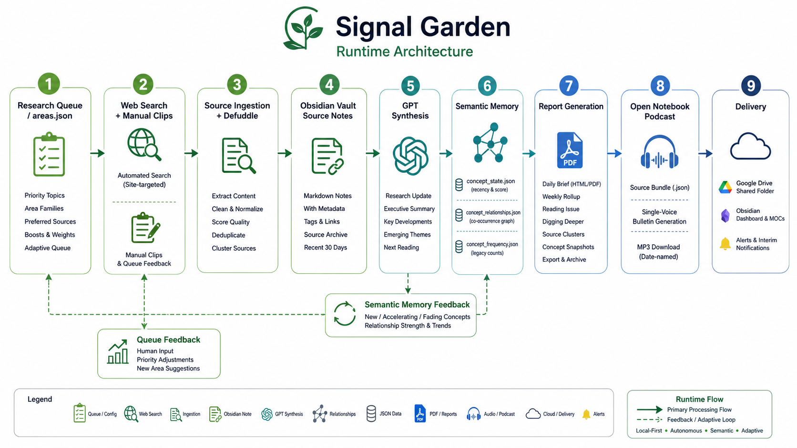

# Signal Garden

Signal Garden is a local-first autonomous research and semantic memory system.

It searches for sources, writes notes into an Obsidian vault, synthesizes daily and weekly briefings, tracks concepts over time, and can turn the reading layer into a single-voice audio bulletin with Open Notebook.

It is not a polished SaaS product or production framework. It is a working reference project for people who want to clone, fork, study, and adapt a personal research agent.



## What It Does

- Runs an autonomous research loop from `areas.json`
- Saves source notes into an Obsidian vault
- Synthesizes daily briefs, weekly rollups, reading issues, and digging-deeper notes
- Tracks concept recency, frequency, and co-occurrence relationships
- Builds dashboard, health, source archive, and trend alert notes
- Generates styled daily HTML/PDF reports
- Renders Active Areas and New Areas as visual report sections
- Supports manual clip ingestion from an Obsidian inbox
- Optionally syncs sources into Open Notebook and generates a single-voice podcast bulletin
- Optionally uploads the latest PDF and podcast MP3 to Google Drive

## Runtime Shape

At runtime, Signal Garden follows this loop:

1. Load research areas and queue priorities from `areas.json`.
2. Search the web and ingest any manual clips.
3. Save source notes into the Obsidian vault.
4. Synthesize a research update with GPT.
5. Extract concepts and update semantic memory.
6. Generate daily, weekly, dashboard, archive, alert, reading, and podcast handoff artifacts.
7. Feed concept momentum and queue feedback back into future research.

See [docs/architecture.md](docs/architecture.md) for a fuller walkthrough.

## Quickstart

These steps are intentionally local-first. The default setup assumes Windows because that is where the project was built, but the core Python scripts should be adaptable elsewhere once paths and external tools are configured.

1. Clone the repo.

```bash
git clone https://github.com/lozknowles/Signal-Garden.git
cd Signal-Garden
```

2. Create and activate a virtual environment.

```bash
python -m venv venv
venv\Scripts\activate
```

3. Install dependencies.

```bash
pip install -r requirements.txt
```

4. Copy the example environment file.

```bash
copy .env.example .env
```

5. Edit `.env`.

Minimum useful values:

```bash
OPENAI_API_KEY=your_api_key_here
SIGNAL_GARDEN_VAULT_PATH=C:\Path\To\Your\ObsidianVault
SIGNAL_GARDEN_CONFIG_PATH=areas.json
```

6. Review `areas.json`.

This file defines the folders, research topics, preferred sources, priority topics, and MOC categories that drive the research loop.

7. Run the agent.

```bash
python signal_garden.py run
```

8. Open your Obsidian vault.

Look for generated notes under folders such as `Daily`, `Weekly`, `Sources`, `MOCs`, `Memory`, `Reading`, `Audio`, `Archive`, and `Alerts`.

## Configuration

The main configuration surfaces are:

- `.env` for local paths, API keys, email, Open Notebook, and Google Drive settings
- `areas.json` for topics, folder mappings, priority boosts, and source preferences
- Obsidian inbox files for manual clips

Important environment variables:

```bash
OPENAI_API_KEY=your_api_key_here
SIGNAL_GARDEN_VAULT_PATH=C:\Path\To\Your\ObsidianVault
SIGNAL_GARDEN_CONFIG_PATH=areas.json
SIGNAL_GARDEN_HEADER_IMAGE_PATH=header.png
ACTIVE_AREAS_MAP_IMAGE_PATH=header-map-clean.png
NEW_AREAS_MAP_IMAGE_PATH=header-map-new-areas.png
```

Do not commit `.env`. It is ignored by git.

## Common Commands

Common commands read paths from `.env`, or you can override them at the command line with `--vault` and, where relevant, `--config`.

Run research:

```bash
python signal_garden.py run
```

Open the local config admin panel:

```bash
python config_admin.py
```

Validate generated state:

```bash
python signal_garden.py validate
```

Dry-run lightweight repairs:

```bash
python signal_garden.py repair
```

Apply lightweight repairs:

```bash
python signal_garden.py repair --apply
```

Preview source-title migrations:

```bash
python migrate_source_note_titles.py
```

Poll and download a completed Open Notebook podcast:

```bash
python signal_garden.py podcast
```

Upload the latest daily PDF and podcast MP3:

```bash
python signal_garden.py upload --latest
```

Test email delivery without a full research run:

```bash
python signal_garden.py run --test-email
```

Run the smoke tests against the bundled sample vault fixture:

```bash
python -m unittest discover -s tests
```

## Semantic Memory

Signal Garden stores semantic state in the vault under `Memory/`:

- `concept_state.json` tracks recency-aware concept records
- `concept_relationships.json` tracks concept co-occurrence edges
- `concept_frequency.json` remains as a legacy count cache
- `queue_feedback.json` lets manual clips influence queue prioritization
- `manual_clip_state.json` prevents repeated ingestion of the same clip

The dashboard surfaces:

- active concepts
- fastest-rising concepts
- active relationships
- recent source clusters
- queue state
- latest reports and reading artifacts
- Open Notebook and podcast status

## Optional Open Notebook Podcast Flow

Open Notebook support is optional.

Signal Garden can write the audio script and Open Notebook handoff while Open Notebook is offline. To sync sources or submit a podcast generation job, Docker Desktop must be running and the Open Notebook stack must already be up.

Start the local stack:

```bash
docker compose -f open-notebook.docker-compose.yml up -d
```

Check that both services are available:

```bash
docker compose -f open-notebook.docker-compose.yml ps
```

Default URLs:

- App: `http://localhost:8502`
- API: `http://localhost:5055`

Opt in through `.env`:

```bash
OPEN_NOTEBOOK_SYNC_ENABLED=true
OPEN_NOTEBOOK_GENERATE_PODCAST=false
OPEN_NOTEBOOK_NOTEBOOK_NAME=Signal Garden
OPEN_NOTEBOOK_EPISODE_PROFILE=signal_forecast
OPEN_NOTEBOOK_SPEAKER_PROFILE=single_forecaster
OPEN_NOTEBOOK_PODCAST_POLL_SECONDS=20
```

Set `OPEN_NOTEBOOK_GENERATE_PODCAST=true` only when Open Notebook has working LLM and TTS credentials. That setting submits a real generation job.

The default podcast prompt aims for a single-presenter audio bulletin: calm, precise, sparse, and closer to a shipping forecast than a radio discussion.

## Optional Google Drive Upload

Google Drive upload is optional.

Use a local Google Drive sync folder:

```bash
GOOGLE_DRIVE_UPLOAD_ENABLED=true
GOOGLE_DRIVE_LOCAL_FOLDER=C:\Path\To\Google Drive\Signal Garden
```

Or use `rclone`:

```bash
GOOGLE_DRIVE_UPLOAD_ENABLED=true
GOOGLE_DRIVE_RCLONE_REMOTE=gdrive:Signal Garden
```

Then run:

```bash
python upload_drive_artifacts.py --latest
```

## Optional Email Delivery

To email the daily PDF, configure SMTP in `.env`:

```bash
PDF_EMAIL_ENABLED=true
PDF_EMAIL_TO=you@example.com
PDF_EMAIL_FROM=signal-garden@example.com
PDF_EMAIL_SUBJECT_PREFIX=Signal Garden Daily Brief
SMTP_HOST=smtp.gmail.com
SMTP_PORT=587
SMTP_USERNAME=signal-garden@example.com
SMTP_PASSWORD=your_smtp_password
SMTP_USE_TLS=true
PDF_EMAIL_BODY_INCLUDE_NEXT_READING=true
PDF_EMAIL_MAX_NEXT_READING=3
```

Signal Garden sends at most one daily PDF email per day.

## Manual Clips

To add read-later links, place them in either:

- `Inbox/manual_clips.json`
- `Inbox/Manual Clips.md`

JSON entries can be simple strings or objects:

```json
[
  {
    "url": "https://example.com/article",
    "topic": "Augmented Reality",
    "reason": "Useful source for the next brief"
  }
]
```

Manual clips are fetched during the next run, saved as source notes, and tracked so the same URL is not repeatedly ingested.

## Known Limitations

This project is useful, but it is not production ready.

If you fork this, treat it as a working garden rather than a boxed product. The known rough edges are tracked in [TODO.md](TODO.md), including modularization, CI, first-run setup, cross-platform hardening, and source-search resilience.

## Public Roadmap

See [TODO.md](TODO.md) for the current public-readiness backlog and follow-up hardening list.

## License

MIT. See [LICENSE](LICENSE).
