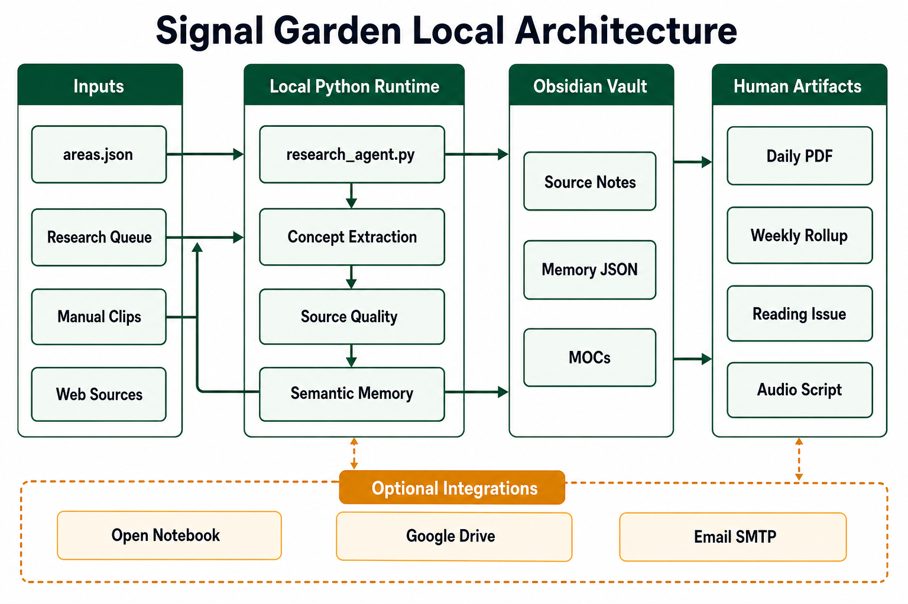
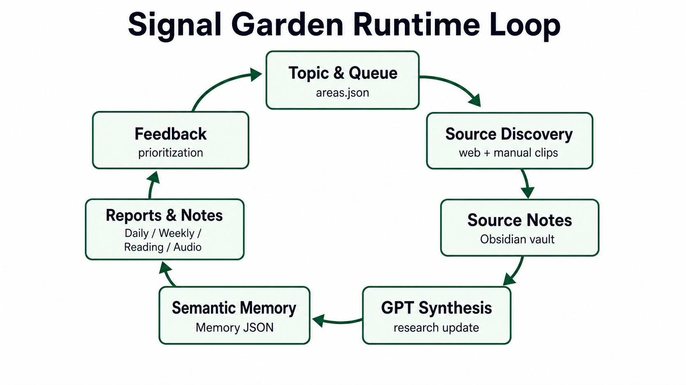
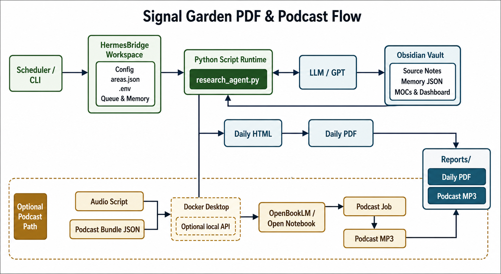

# Signal Garden Architecture

Signal Garden is organized around a local runtime loop rather than a hosted service.

The core idea is simple:

1. Sources become notes.
2. Notes become synthesis.
3. Synthesis becomes semantic memory.
4. Semantic memory influences the next research run.

*Figure 1. Signal Garden runs as a local Python workflow around an Obsidian vault. Inputs flow through `research_agent.py`, semantic memory is written back as local JSON and notes, and optional integrations stay outside the core local loop.*

## Runtime Loop

*Figure 2. The runtime loop turns topics and source discovery into notes, synthesis, memory, reports, and prioritization feedback for the next run.*

### 1. Topic And Queue Selection

`areas.json` defines the active research areas, folders, preferred sources, and priority topics.

The agent chooses a topic from the queue, applies priority boosts, and keeps a record of which areas are active or newly emerging.

### 2. Source Discovery

The agent searches the web and also checks manual clips from the Obsidian inbox.

Manual clips can be placed in:

- `Inbox/manual_clips.json`
- `Inbox/Manual Clips.md`

### 3. Source Ingestion

Fetched sources are cleaned where possible, summarized into source notes, and written into the Obsidian vault.

The vault remains the main durable store. Signal Garden does not require a hosted database for its own memory.

### 4. GPT Synthesis

The agent uses GPT to synthesize a research update from the current source set.

The synthesis tries to answer:

- what matters now
- what is increasing
- what is connected
- what should be researched next

### 5. Semantic Memory

Signal Garden writes semantic state under `Memory/`:

- `concept_state.json`
- `concept_relationships.json`
- `concept_frequency.json`
- `queue_feedback.json`
- `manual_clip_state.json`

Concept state tracks recency and recurrence. Relationship state tracks co-occurrence between concepts.

### 6. Artifacts

The runtime writes human-facing artifacts back into the vault:

- `Daily/`
- `Weekly/`
- `Reading/`
- `Audio/`
- `Archive/`
- `Alerts/`
- `MOCs/`
- `Reports/`

The styled daily HTML/PDF report is generated from the same synthesized data as the Obsidian notes.

### 7. Optional Podcast Layer

When enabled, Signal Garden creates an Open Notebook source bundle and can submit a podcast generation job.

The intended podcast style is a single-voice bulletin: precise, sparse, and source-grounded.

The completed MP3 can be downloaded into `Reports/` and optionally uploaded to Google Drive.

*Figure 3. The daily PDF is produced directly by the local Python runtime, while the podcast path is optional: Signal Garden writes an audio script and source bundle, then Docker-hosted OpenBookLM / Open Notebook can turn that handoff into a podcast MP3.*

### 8. Feedback

Concept momentum, relationship movement, source quality, and manual clip feedback all influence future prioritization.

That feedback loop is what makes Signal Garden more than a one-shot summarizer.

## Main Scripts

- `research_agent.py`: end-to-end research, synthesis, memory, reporting, and optional podcast handoff
- `config_admin.py`: local maintenance UI for `areas.json`
- `validate_signal_garden.py`: read-only validation of generated state
- `repair_signal_garden.py`: dry-run-first lightweight state repair
- `monitor_open_notebook_podcast.py`: polls Open Notebook and downloads completed audio
- `upload_drive_artifacts.py`: uploads latest report and podcast artifacts
- `migrate_source_note_titles.py`: previews and applies source-title cleanup

## Current Design Trade-Offs

Signal Garden favors local control and hackability over product polish.

That means:

- Obsidian is the durable knowledge layer.
- JSON files are used for semantic memory.
- The Python code is easy to inspect but not yet split into tidy modules.
- Optional integrations are deliberately opt-in.

For a fork, the best first improvements are path cleanup, tests, and module boundaries.
